# concurrency-example
재고관리 시스템 예제를 통해 동시성 문제 해결 방법을 탐구 

-> inflearn ***[재고시스템으로 알아보는 동시성이슈 해결방법](https://www.inflearn.com/course/%EB%8F%99%EC%8B%9C%EC%84%B1%EC%9D%B4%EC%8A%88-%EC%9E%AC%EA%B3%A0%EC%8B%9C%EC%8A%A4%ED%85%9C/dashboard)*** 강의를 듣고 실습한 내용입니다.

# 개요
동시성 이슈란 여러 스레드가 동시에 특정 자원을 제어하려는 시도가 발생하면서 생기는 문제를 의미한다.

# StockServiceTest.java
멀티 스레드 환경을 구현한 Service Test 코드를 살펴본다.
## ExecutorService
ExecutorService란 병렬 작업시 여러개의 작업을 효율적으로 처리하기 위해 제공되는 자바 라이브러리이다.
ExecutorService는 손쉽게 ThreadPool을 구성하고 Task를 실행하고 관리할 수 있는 역할을 한다.
Executors를 사용하여 ExecutorService 객체를 생성하며 스레드 풀의 개수 및 종류를 지정할 수 있는 메소드를 제공한다.

## CountDownLatch
CountDownLatch란 어떤 스레드가 다른 스레드에서 작업이 완료될 때까지 기다릴 수 있도록 해주는 클래스이다.
CountDownLatch 를 이용하여, 멀티스레드가 100번 작업이 모두 완료한 후 테스트를 하도록 기다리게 한다.

### CountDownLatch 작동원리
new CountDownLatch(5); 를 이용해 Latch할 갯수를 지정한다.
countDown()을 호출하면 Latch의 숫자가 1개씩 감소한다.
await() 은 Latch의 숫자가 0이 될 때 까지 기다리는 코드이다.
```java
package com.example.stock.service;

import com.example.stock.domain.Stock;
import com.example.stock.repository.StockRepository;
import org.junit.jupiter.api.AfterEach;
import org.junit.jupiter.api.BeforeEach;
import org.junit.jupiter.api.Test;
import org.springframework.beans.factory.annotation.Autowired;
import org.springframework.boot.test.context.SpringBootTest;

import java.util.concurrent.CountDownLatch;
import java.util.concurrent.ExecutorService;
import java.util.concurrent.Executors;

import static org.junit.jupiter.api.Assertions.*;

@SpringBootTest
class StockServiceTest {

	@Autowired
	private StockService stockService;

	@Autowired
	private StockRepository stockRepository;

	@BeforeEach
	public void insert() {
		Stock stock = new Stock(1L, 100L);
		stockRepository.saveAndFlush(stock);
	}

	@AfterEach
	public void delete() {
		stockRepository.deleteAll();
	}

	@Test
	public void decrease_test() {
		stockService.decrease(1L, 1L);
		Stock stock = stockRepository.findById(1L).orElseThrow();
		// 테스트 결과 100 - 1 = 99
		assertEquals(99, stock.getQuantity());
	}

	@Test
	public void 동시에_100명이_주문() throws InterruptedException {
		// 100개의 요청
		int threadCount = 100;
		// 비동기로 실행하는 작업을 단순화하여 사용할 수 있게 하는 Java API ExecutorService
		ExecutorService executorService = Executors.newFixedThreadPool(32);
		// 100개의 요청이 끝날때까지 기다리는 다른 스레드에서 실행중인 작업이 완료될 때까지 기다리도록 하는 클래스 CountDownLatch
		CountDownLatch latch = new CountDownLatch(threadCount);

		for (int i = 0; i < threadCount; i++) {
			executorService.submit(() -> {
				try {
					stockService.decrease(1L, 1L);
				} finally {
					latch.countDown();
				}
			});
		}

		latch.await();
		Stock stock = stockRepository.findById(1L).orElseThrow();
		// 100 - (100 * 1) = 0
		assertEquals(0, stock.getQuantity());
	}
}
```
위 코드를 실행한 결과는 아래와 같다.
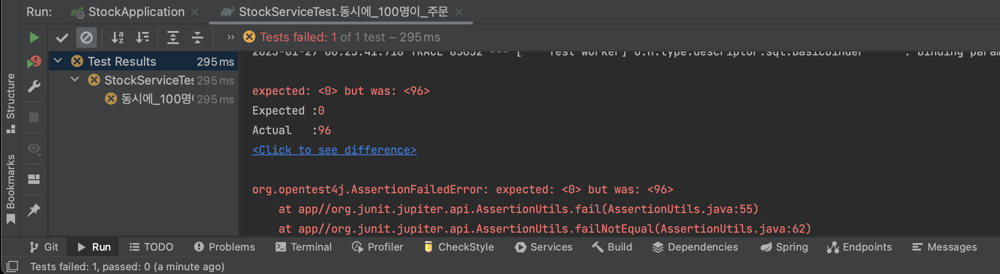
## 테스트 실패
CountDownLatch를 이용하여 멀티스레드 작업이 100번의 재고감소 로직을 호출한 뒤에 재고가 0이 되는지 확인했지만 실제로는 의외의 값이 나온다.
그 이유는 레이스 컨디션(Race Condition) 이 일어나기 때문이다.
레이스 컨디션이란 2이상의 스레드가 공유 데이터에 액세스 할 수 있고 동시에 변경하려할 때 발생할 수 있는 문제를 말한다.

# 레이스 컨디션에 대해

## 멀티스레드 환경에서 레이스 컨디션이 발생하는 이유
### 예상 작업 순서
우리가 멀티스레드로 작업을 할 때 예상한건 아래의 그림처럼 순차적으로 데이터에 접근해 처리하고 처리된 데이터를 다음 스레드가 접근하여 처리하는 그림이다.
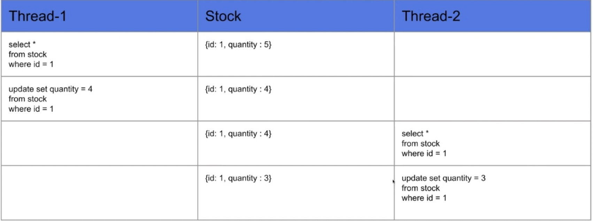

### 실제 작업 순서
하지만 실제로는 아래의 그림처럼 같은 데이터를 동시에 변경 (공유된 가변 데이터) 하려 하기 때문에 작업 중 하나가 누락 되게 될 수 있다.
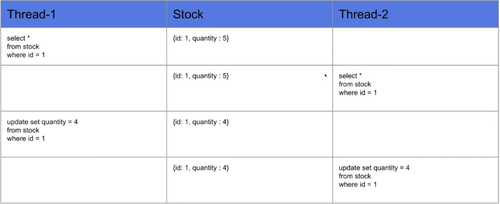

## 레이스 컨디션 해결 방법
레이스 컨디션을 해결하는 방법은 하나의 스레드가 작업을 완료한 후에 다른 스레드가 공유된 자원에 접근 가능하도록 해야 한다.

### 방법 1) Synchronized 키워드 이용
- Synchronized를 메소드에 명시해주면 하나의 스레드만 접근이 가능하다.
- 멀티스레드 환경에서 스레드간 데이터 동기화를 시켜주기 위해서 자바에서 제공하는 키워드이다.
- 공유되는 데이터의 Thread-safe를 하기 위해 synchronized로 스레드간 동기화를 시켜 thread-safe 하게 만들어 준다.
- 자바에서 지원하는 synchronized는 현제 데이터를 사용하고 있는 해당 스레드를 제외하고 나머지 스레드들은 데이터 접근을 막아 순차적으로 데이터에 접근할 수 있도록 해준다.

```java
package com.example.stock.service;

import com.example.stock.domain.Stock;
import com.example.stock.repository.StockRepository;
import org.junit.jupiter.api.AfterEach;
import org.junit.jupiter.api.BeforeEach;
import org.junit.jupiter.api.Test;
import org.springframework.beans.factory.annotation.Autowired;
import org.springframework.boot.test.context.SpringBootTest;

import java.util.concurrent.CountDownLatch;
import java.util.concurrent.ExecutorService;
import java.util.concurrent.Executors;

import static org.junit.jupiter.api.Assertions.*;

@SpringBootTest
class StockServiceTest {

	@Autowired
	private StockService stockService;

	@Autowired
	private StockRepository stockRepository;

	@BeforeEach
	public void insert() {
		Stock stock = new Stock(1L, 100L);
		stockRepository.saveAndFlush(stock);
	}

	@AfterEach
	public void delete() {
		stockRepository.deleteAll();
	}

	@Test
	public void decrease_test() {
		stockService.decrease(1L, 1L);
		Stock stock = stockRepository.findById(1L).orElseThrow();
		// 테스트 결과 100 - 1 = 99
		assertEquals(99, stock.getQuantity());
	}

	@Test
	public void 동시에_100명이_주문() throws InterruptedException {
		// 100개의 요청
		int threadCount = 100;
		// 비동기로 실행하는 작업을 단순화하여 사용할 수 있게 하는 Java API ExecutorService
		ExecutorService executorService = Executors.newFixedThreadPool(32);
		// 100개의 요청이 끝날때까지 기다리는 다른 스레드에서 실행중인 작업이 완료될 때까지 기다리도록 하는 클래스 CountDownLatch
		CountDownLatch latch = new CountDownLatch(threadCount);

		for (int i = 0; i < threadCount; i++) {
			executorService.submit(() -> {
				try {
					stockService.decrease(1L, 1L);
				} finally {
					latch.countDown();
				}
			});
		}

		latch.await();
		Stock stock = stockRepository.findById(1L).orElseThrow();
		// 100 - (100 * 1) = 0
		assertEquals(0, stock.getQuantity());
	}
}
```
위 코드를 실행한 결과는 아래와 같다.

## 테스트 실패
CountDownLatch를 이용하여 멀티스레드 작업이 100번의 재고감소 로직을 호출한 뒤에 재고가 0이 되는지 확인했지만 실제로는 의외의 값이 나온다.
그 이유는 레이스 컨디션(Race Condition) 이 일어나기 때문이다.
레이스 컨디션이란 2이상의 스레드가 공유 데이터에 액세스 할 수 있고 동시에 변경하려할 때 발생할 수 있는 문제를 말한다.

# 레이스 컨디션에 대해

## 멀티스레드 환경에서 레이스 컨디션이 발생하는 이유
### 예상 작업 순서
우리가 멀티스레드로 작업을 할 때 예상한건 아래의 그림처럼 순차적으로 데이터에 접근해 처리하고 처리된 데이터를 다음 스레드가 접근하여 처리하는 그림이다.


### 실제 작업 순서
하지만 실제로는 아래의 그림처럼 같은 데이터를 동시에 변경 (공유된 가변 데이터) 하려 하기 때문에 작업 중 하나가 누락 되게 될 수 있다.


## 레이스 컨디션 해결 방법
레이스 컨디션을 해결하는 방법은 하나의 스레드가 작업을 완료한 후에 다른 스레드가 공유된 자원에 접근 가능하도록 해야 한다.

### 방법 1) Synchronized 키워드 이용
- Synchronized를 메소드에 명시해주면 하나의 스레드만 접근이 가능하다.
- 멀티스레드 환경에서 스레드간 데이터 동기화를 시켜주기 위해서 자바에서 제공하는 키워드이다.
- 공유되는 데이터의 Thread-safe를 하기 위해 synchronized로 스레드간 동기화를 시켜 thread-safe 하게 만들어 준다.
- 자바에서 지원하는 synchronized는 현제 데이터를 사용하고 있는 해당 스레드를 제외하고 나머지 스레드들은 데이터 접근을 막아 순차적으로 데이터에 접근할 수 있도록 해준다.


```java
/**
* 재고 감소
  */
  // @Transactional 어노테이션은 없어야 한다.
  public synchronized void decrease(final Long id, final Long quantity) {
  Stock stock = stockRepository.findById(id).orElseThrow();
  stock.decrease(quantity);
  stockRepository.saveAndFlush(stock);
  }
```
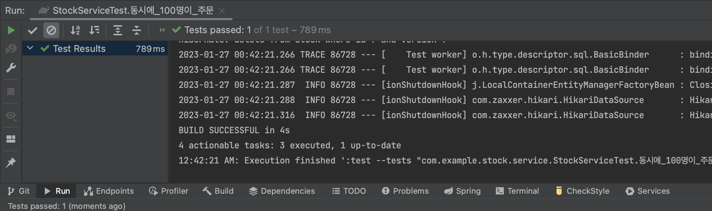

### 자바 Synchronized 의 문제점
자바의 Sychronized는 하나의 프로세스 안에서만 보장이 된다.
즉, 서버가 1대일때는 문제가 없지만 서버가 2대 이상일 경우 데이터에 대한 접근을 막을 수가 없다.
서버가 여러대 일 경우 Synchronized 는 각 프로세스의 동시접근 제어만을 보장해주기 때문에 다른 서버에서 가변 공유데이터에 접근하는 것을 막을 수가 없어 업데이트 도중 값이 변경될 수 있는 문제점이 여전히 남아 있다.
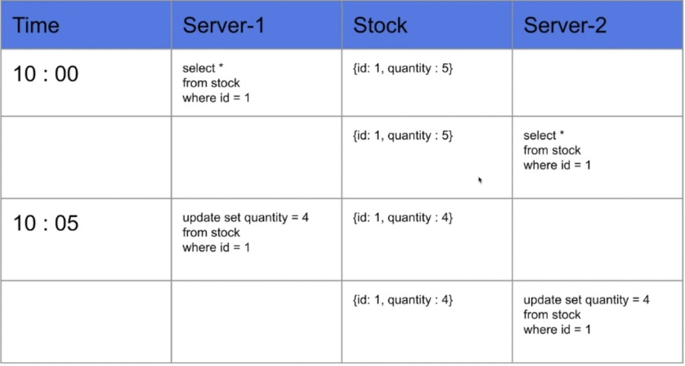

### 방법 2) Database Lock 활용

2번째 방법은 DataBase Lock을 이용해 순차적인 접근으로 제어하는 방법이다.
세가지 Lock을 비교해보고 각 장단점을 정리한다.
- Pessimistic Lock
- Optimistic Lock
- Named Lock

### 1. Pessimistic Lock
- 실제로 데이터에 Lock을 걸어서 정합성을 맞추는 방법이다.
- exclusive lock(베타적 잠금)을 걸게되면 다른 트랜잭션에서는 lock이 해제되기전에 데이터를 가져갈 수 없게 된다.
- 자원 요청에 따른 동시성 문제가 발생할 것이라고 예상하고 락을 거는 비관적 락 방식이다. 하지만, 데드락이 걸릴 수 있기 때문에 주의하여 사용해야 한다.

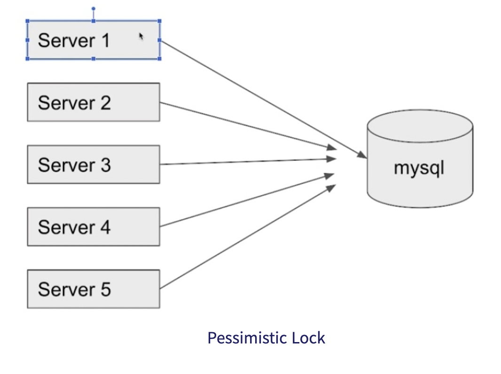

예를들어 Server 1 DB 데이터를 가져올 때 Lock을 걸면 다른 서버에서는 Server1의 작업이 끝나 락이 풀릴 때 까지 데이터에 접근하지 못하게 한다.
결론적으로 Pesimistic Lock이란 데이터에는 락을 가진 스레드만 접근이 가능하도록 제어하는 방법이다.

### Pessimistic Lock 의 장점

- 충돌이 빈번하게 일어난다면 롤백의 횟수를 줄일 수 있기 때문에 Optimistic Lock 보다는 성능이 좋을 수 있다.
- 비관적 락을 통해 데이터를 제어하기 때문에 데이터 정합성을 어느정도 보장할 수 있다.

### Pessimistic Lock 의 단점

- 데이터 자체에 별도의 락을 잡기때문에 동시성이 떨어져 성능저하가 발생할 수 있다.
- 특히 읽기가 많이 이루어지는 데이터베이스의 경우에는 손해가 더 크다.
- 서로 자원이 필요한 경우, 락이 걸려있으므로 데드락이 일어날 가능성이 있다.

### 2. Optimisitc Lock

- 실제로 **Lock을 이용하지 않고** 버전을 이용함으로써 정합성을 맞추는 방법이다.
- 먼저 데이터를 읽은 후에 update를 수행할 때 현재 내가 읽은 **버전이 맞는지 확인하여** 업데이트 한다. 
- 자원에 락을 걸어서 선점하지 않고 동시성 문제가 발생하면 그때가서 처리하는 낙관적 락 방식이다. 내가 읽은 버전에서 수정사항이 생겼을 경우에는 application에서 다시 읽은 후에 작업을 수행하는 롤백 작업을 수행해야 한다.
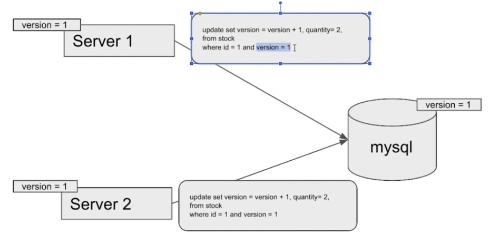

[Optimisitc Lock 과정]

1) Server 1이 version 1 임을 조건절에 명시하면서 업데이트 쿼리를 실행한다.
2) version 1 쿼리가 업데이트 되어서 디비는 version 2가 된다.
3) Server 2가 version 1로 업데이트 쿼리를 실행하면 버전이 맞지않아 실패한다.
4) 쿼리가 실패하면 Server 2에서 다시 조회하여 버전을 맞춘 후 업데이트 쿼리를 실행하는 과정을 거친다.

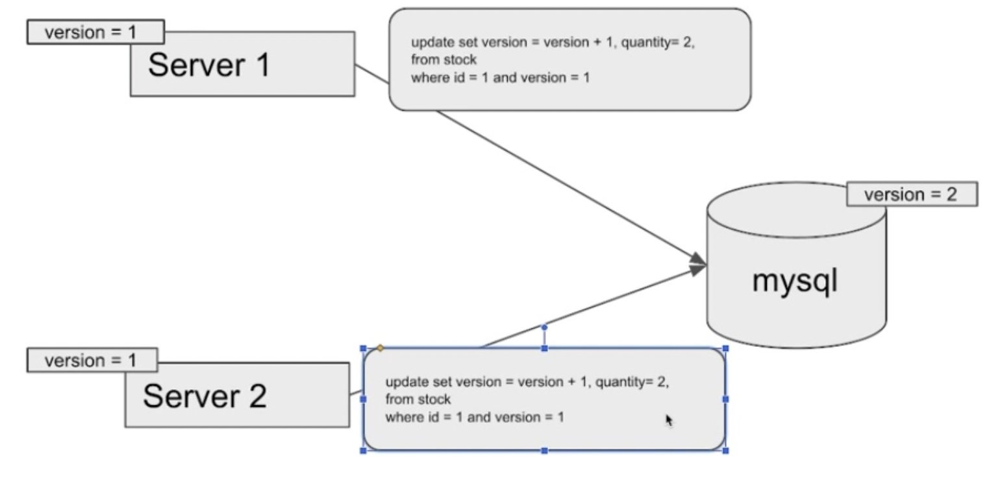

### Optimisitc Lock 의 장점

- 충돌이 안난다는 가정하에 별도의 락을 잡지 않으므로 Pessimistic Lock 보다는 성능적 이점을 가진다.

### Optimisitc Lock 의 단점

- 업데이트가 실패했을 때 재시도 로직을 개발자가 직접 작성해 주어야 한다.
- 충돌이 빈번하게 일어나거나 예상이되면 롤백처리를 해주어야하기 때문에 Pessimistic Lock이 더 성능이 좋을 수도 있다.

### 3. Named Lock
- Named Lock은 이름을 가진 metadata Lock 이다.
- 이름을 가진 락을 획득한 후 해지될때 까지 다른 세션은 이 락을 획득할 수 없게 된다.
- 주의할 점은 트랜잭션이 종료될  락이 자동으로 해지되지 않기 때문에 별도로 해지해주거나 선점시간이 끝나야 해지된다.
- Mysql 에서는 getLock( )을 통해 획득 / releaseLock()으로 해지 할 수 있다.

Named Lock은 Passimistic Lock과 유사하지만 Passimistic Lock은 row 나 table 단위로 락을 걸고 Named Lock은 metadata 단위로 락을 건다는 차이점이 존재한다.

[Named lock 시 Lock 점유 과정]

- Named Lock은 Stock에 락을 걸지 않고 별도의 공간에 락을 건다.
- session-1 이 1이라는 이름으로 락을 건다면 session 1 이 1을 해지한 후에 락을 얻을 수 있다.

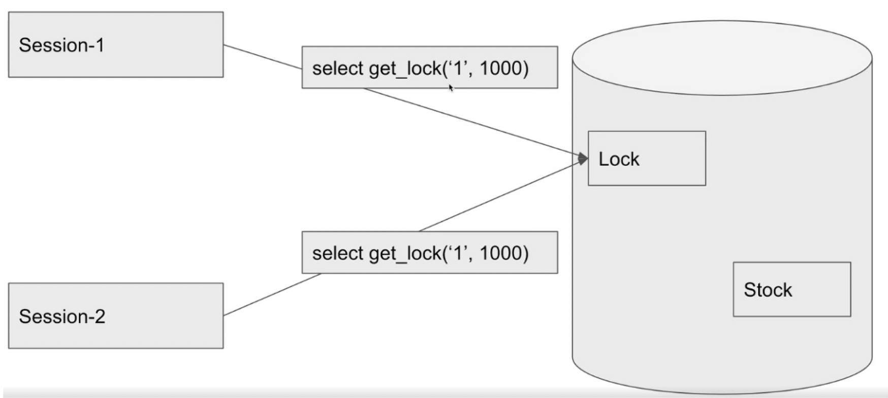

### Named lock 주의 사항
예제에서는 동일한 DataSource를 사용하지만 실무에서는 커넥션 풀이 부족해질 수 있기에 DataSoruce를 분리하는 걸 추천한다고 한다.


### Named Lock 의 장점

- NamedLock은 주로 분산락을 구현할 때 사용한다.
- Pessimistic Lock은 time out을 구현하기 굉장히 힘들지만 Named Lock은 비교적 손쉽게 구현할 수 있다.
- 그 외에 데이터 정합성을 맞춰야하는 경우에도 사용할 수 있다.

### Named Lock 의 단점

- Naemd Lock 은 트랜잭션 종료 시에 락 해제와 세션관리를 잘 해주어야하므로 주의해서 사용주어야 한다.
- 또 실제 사용할 때는 구현방법이 복잡할 수 있다.

## 동시성 문제 해결을 위한 Redis 활용

Redis 를 사용하여 동시성 문제를 해결하는 대표적인 라이브러리 2가지가 존재한다.
- Lettuce
- Redisson

### Lettuce
- Setnx 명령어를 활용하여 분산락을 구현 (Set if not Exist - key:value를 Set 할 . 기존의 값이 없을 때만 Set 하는 명령어)
- Setnx 는 Spin Lock방식이므로 retry 로직을 개발자가 작성해 주어야 한다.
- Spin Lock 이란 Lock 을 획득하려는 스레드가 Lock을 획득할 수 있는지 확인하면서 반복적으로 시도하는 방법이다.

[Spin Lock 과정]
- 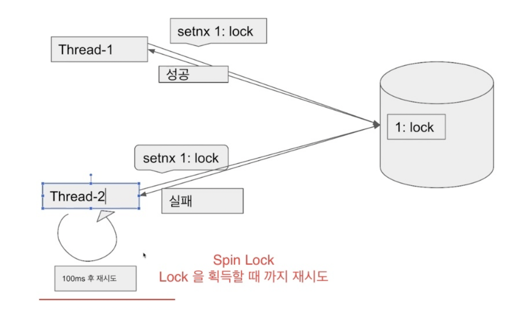

### Redisson
- Pub-sub 기반으로 Lock 구현 제공
- Pub-Sub 방식이란 채널을 하나 만들고 락을 점유중인 스레드가 락을 해제했음을 대기중인 스레드에게 알려주면 대기중인 스레드가 락 점유를 시도하는 방식이다.
- 이 방식은 Lettuce와 다르게 대부분 별도의 Retry 방식을 작성하지 않아도 된다.

[pub-sub 과정]
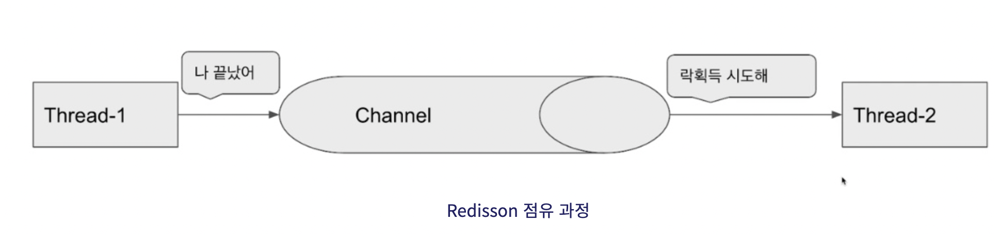

### Lettuce vs Redisson
**Lettuce**
- 구현이 간단하다.
- Spring data redis를 이용하면 lettuce가 기본이기 문에 별도의 라이브러리를 사용하지 않아도 된다.
- Spin Lock 방식이기 때문에 동시에 많은 스레드가 lock 획득 대기 상태라면 redis에 부하가 갈 수 있다.


**Redisson**
- 락 획득 재시도를 기본으로 제공한다.
- pub-sub 방식으로 구현이 되어있기 때문에 lettuce 와 비교했을 때 redis에 부하가 덜 간다.
- 별도의 라이브러리를 사용해야한다.
- lock을 라이브러리 차원에서 제공해주기 때문에 사용법을 공부해야 한다.
